# Exercise 1 (UDP Input -> Output via UI)

This exercise has 4 main parts
* Configure Input
* Configure Destination
* Configure Rules
* Visualize data flowing

Before we get started, every station has the following information:

For Exercise 1:
* CTB Manager IP (on AWS)
* CTB Manager login credentials (username/password)
* UDP Input listening port
* UDP Destination address and port

Use this data at your workstation for this exercise.

## 1.1 Configure Input

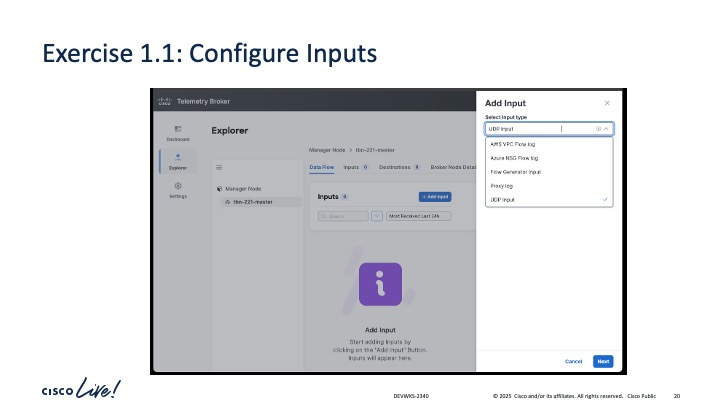

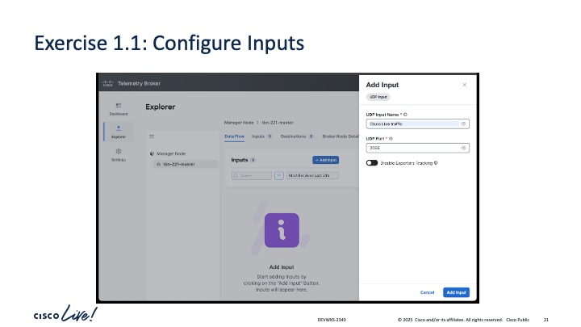

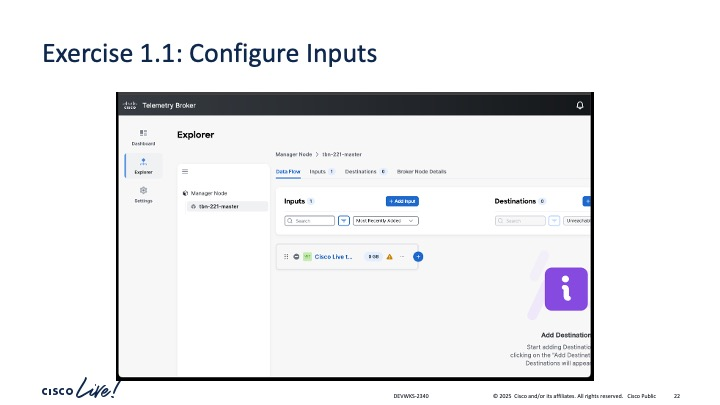

## 1.2 Configure Destination

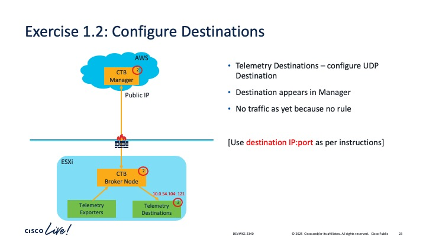

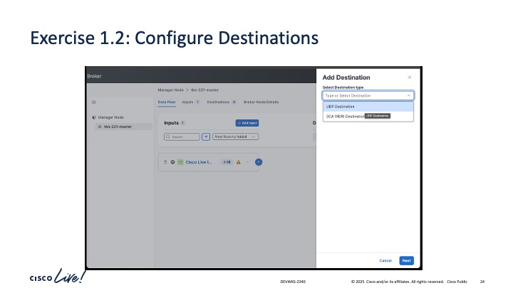

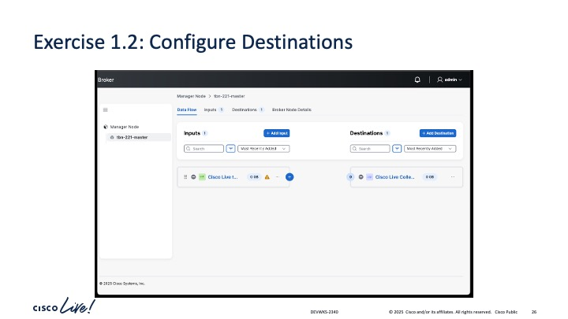

## 1.3 Configure Rules

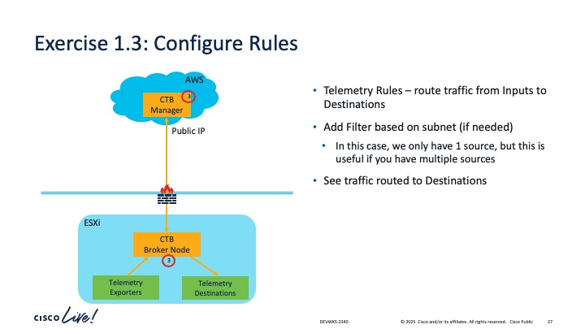

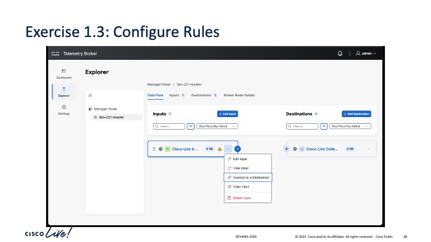

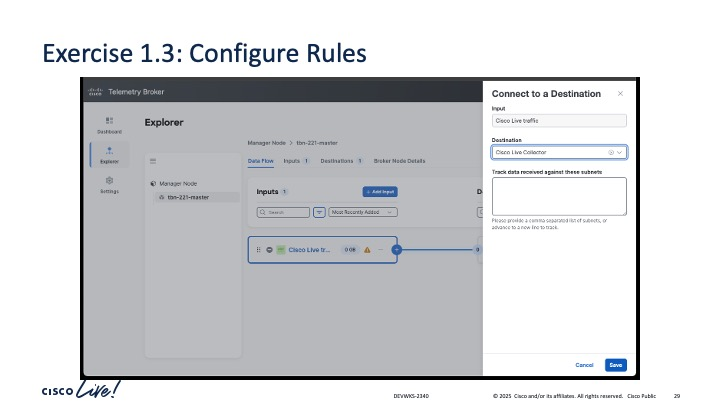

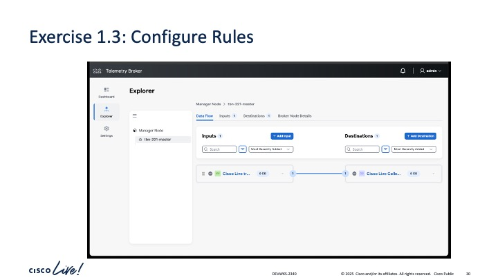

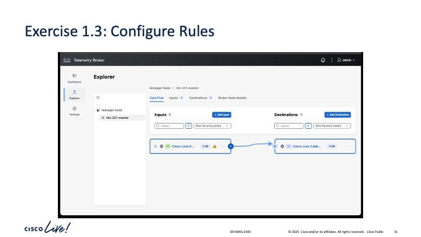

## 1.4 Visualize Data

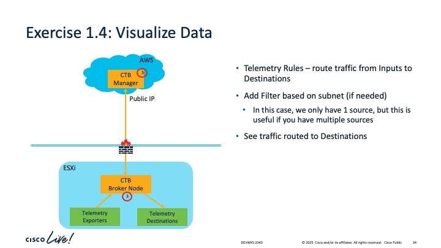

