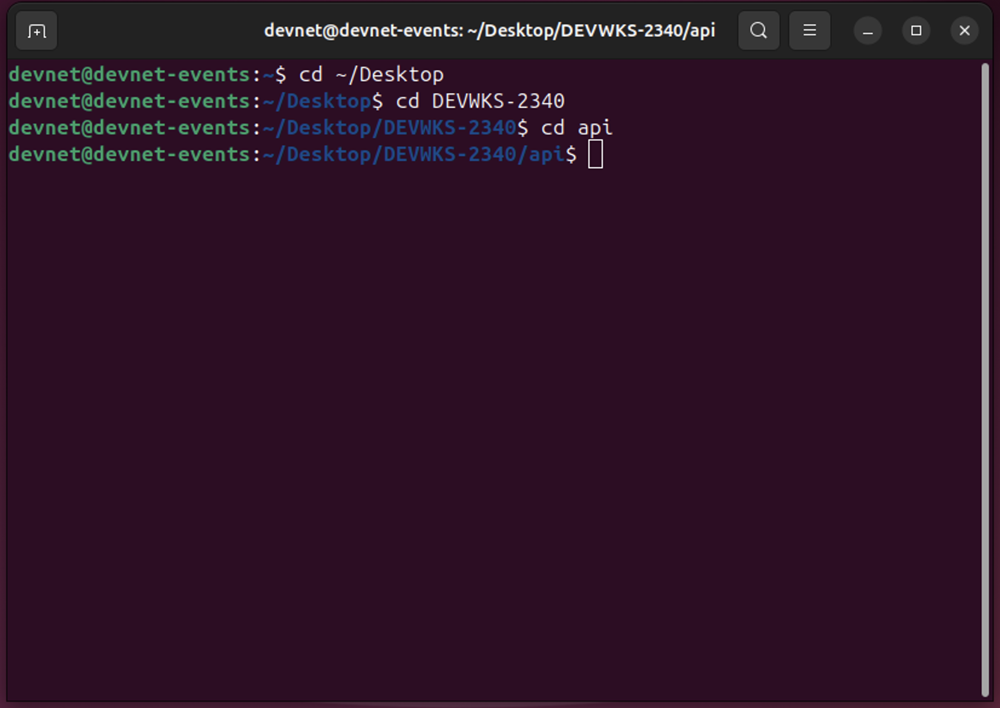
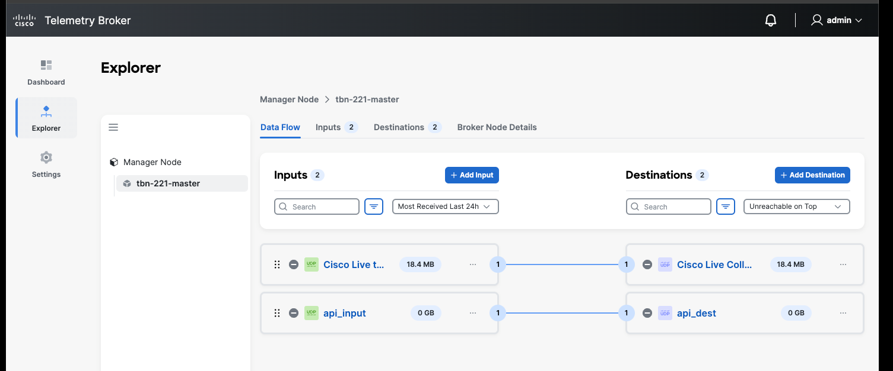

# Exercise 2 (UDP Input -> Output via API)

In this exercise, we will connect to the CTB Manager via API calls and repeat Exercise 1 using the CTB API

Before we get started, every station has the following information:

For Exercise 2:
* CTB Manager IP (on AWS)
* CTB Manager login credentials (username/password)
* UDP Input listening port
* UDP Destination address and port

Use this data at your workstation for this exercise.

## 2.0 Overview

Cisco Telemetry Broker has a well-defined API for all operations. The User Interface (UI) of the CTB Manager uses this API for all data-related operations. You can see for yourself by using the UI to connect to the CTB Manager, then turning on `Inspect mode` in the browser and analyzing all the network calls.

In this exercise, the API can be accessed using a set of python function calls which implement the CTB Manager API.

Here are the initial steps:
* Open a terminal window on your workstation
* Find the project folder (`~/Desktop/DEVWKS-2340`) and `cd` into it
* Open the api directory under the Project folder (`cd api`)

Your Terminal window should look like this:



All of the necessary API commands for this Exercise are enumerated in the file `ctb.py`. Interested folks can peruse this file at your leisure.

We will run this Exercise using Python's interactive mode so that it becomes simpler to step through the various operations.

To get started do this in the terminal window:
```
devnet@devnet-events: ~/Desktop/DEVWKS-2340/api$ python3 start_ctb.py
```

Your terminal should look like this:

```
devnet@devnet-events: ~/Desktop/DEVWKS-2340/api$ python3 ./start_ctb.py 
CTB Python API Shell. Type in the following to get started: 
     (use the managerip, username, password from the lab environment) 
     >>> import ctb
     >>> response = ctb.login(manager_ip, username, password)
     >>> print (response.cookies)
>>>
```

And we are ready to go.

Note 1: At any point, you can exit the interactive shell using `quit()` and restart it
Note 2: All of the commands used in the exercise are enumerated in the file `.exercise-1.py` (note the `.` in the beginning of the file name)

## 2.1 Login

```
>>> import ctb
>>> manager_ip = "<your-manager-IP>"
>>> username = "<username>"
>>> password = "<password>"
>>> 
>>> response = ctb.login(manager_ip, username, password)
>>> print (response)
<Response [201]>
```

This indicates that the `login()` to the CTB Manager worked

Let's now see which Broker Nodes are connected to the Manager

```
>>> nodes = ctb.get_nodes()
>>> print(nodes.json())
```
You should see the entire array of Nodes (in your case there is most likely just 1 with all the fields)

```
>>> print (nodes.json()[0]["id"])
```
Extract the node id of the first node - we will need it later

## 2.2 Create an Input

Continuing with the same prompt, we can first examine all the different input types that are available on this system

```
>>> input_types = ctb.get_input_types()
>>> print(input_types.json())
[{'id': 2, 'name': 'aws_flowlog', 'is_enabled': True, 'label': 'AWS VPC Flow log', 'ha_compatible': False, 'max_instances_per_node': None, 'created': '2025-01-31T19:04:44.608173Z', 'lastupdatedtime': '2025-01-31T19:04:44.608173Z'}, {'id': 3, 'name': 'azure_flowlog', 'is_enabled': True, 'label': 'Azure NSG Flow log', 'ha_compatible': False, 'max_instances_per_node': None, 'created': '2025-01-31T19:04:44.612737Z', 'lastupdatedtime': '2025-01-31T19:04:44.612737Z'}, {'id': 4, 'name': 'flow_generator', 'is_enabled': True, 'label': 'Flow Generator Input', 'ha_compatible': False, 'max_instances_per_node': 1, 'created': '2025-01-31T19:04:44.888487Z', 'lastupdatedtime': '2025-01-31T19:04:44.888487Z'}, {'id': 5, 'name': 'proxy_logs', 'is_enabled': True, 'label': 'Proxy log', 'ha_compatible': True, 'max_instances_per_node': 5, 'created': '2025-01-31T19:04:45.460773Z', 'lastupdatedtime': '2025-01-31T19:04:45.460773Z'}, {'id': 1, 'name': 'udp_listener', 'is_enabled': True, 'label': 'UDP Input', 'ha_compatible': True, 'max_instances_per_node': None, 'created': '2025-01-31T19:04:44.603390Z', 'lastupdatedtime': '2025-01-31T19:04:44.603390Z'}]
```

In this exercise, we will create a `UDP Input` - type is `udp_listener`

```
>>> new_input = ctb.create_input("api_input", "udp_listener", "2", "2055", False)
>>> print (new_input.status_code)
201
>>> print(new_input.json())
```

You should now see the new input that was just created. Something like this:
```
{'id': 7, 'name': 'api_input', 'created': '2025-02-03T22:07:25.587726Z', 'node': 2, 'cluster': None, 'input_type': 'udp_listener', 'subscription_set': [], 'consumers': [], 'input_type_label': 'UDP Input', 'is_supported_subnets': True, 'max_instances_per_node': None, 'port': 4789, 'track_exporter_disabled': False}
```

Again, make a note of the first field, which is the `input id` - we are going to use it for subscriptions

## 2.3 Create a Destination

Continuing with the same prompt, we will create a `UDP Destination` - type is `udp`

```
>>> new_dest = ctb.create_destination("api_dest", "udp", "10.0.54.121", "20001", False)
>>> print (new_dest.status_code)
201
>>> print (new_dest.json())
```

You should now see the new destination that was just created. Something like this:
```
{'id': 5, 'name': 'api_dest', 'alerts': [], 'subscription_set': [], 'created': '2025-02-03T22:14:00.169682Z', 'type': 'udp', 'address': '10.0.54.250', 'port': 4789, 'dcd_enabled': False}
```

Again, make a note again of the first field, which is the `destination id` - we are going to use it for subscriptions

## 2.4 Connect Input to Destination using a Subscription rule

Continuing with the same prompt,

```
>>> new_sub = ctb.create_subscription("7", "5")
>>> print (new_sub.status_code)
201
>>> print (new_sub.json())
{'id': 4, 'source': 7, 'destination': 5, 'subnets': []}
```

This shows that a subscription with `id = 4` was created between the source and destination.

You can confirm this by examining the UI which should show something like this:



## 2.5 Check metrics

If data is now flowing at Input and Destination, one can verify that by examining the input for details. 

```
>>> current_input = ctb.get_inputs("7")
>>> print(current_input.json())
{'id': 7, 'name': 'api_input', 'created': '2025-02-03T22:07:25.587726Z', 'node': 2, 'cluster': None, 'input_type': 'udp_listener', 'metrics': {'rx_pkts': None, 'rx_bytes': None, 'rx_bps': None}, 'exporter_counts': [], 'num_destinations': 1, 'telemetry_types': [], 'subscription_set': [{'id': 4, 'port': 4789, 'source': 7, 'destination': 5, 'subnets': [], 'type': 'network'}], 'last_time': None, 'warnings': [], 'status': 'inactive', 'consumers': [5], 'unique_exporter_count': 0, 'alerts': [], 'input_type_label': 'UDP Input', 'is_supported_subnets': True, 'max_instances_per_node': None, 'port': 4789, 'track_exporter_disabled': False}
```

And similarly for destination,

```
>>> current_dest = ctb.get_destinations("5")
>>> print(current_dest.json())
{'id': 5, 'name': 'api_dest', 'alerts': [], 'exporter_count': 0, 'metrics': {'tx_pkts': None, 'tx_bytes': None, 'tx_bps': None, 'dropped_pkts': None, 'dropped_bytes': None}, 'subscription_set': [{'id': 4, 'port': 4789, 'source': 7, 'destination': 5, 'subnets': [], 'type': 'network'}], 'created': '2025-02-03T22:14:00.169682Z', 'type': 'udp', 'last_time': None, 'status': 'inactive', 'address': '10.0.54.250', 'port': 4789, 'dcd_enabled': False}
```

## 2.6 Summary

The CTB Manager APIs offer a powerful way to program the Cisco Telemetry Broker to process telemetry via Inputs and then route telemetry to Destinations with simple API calls. 

Using this feature, one can build all kinds of tooling and workflows for dynamic telemetry management as well as visualizations embedded into custom dashboards.

We hope you find this useful.
