# Cisco Live EMEA 2025

## Introducing the Cisco Telemetry Broker (CTB) [DEVWKS-2340]

Welcome to this Devnet session on the Cisco Telemetry Broker.

The Cisco Telemetry Broker optimizes your telemetry pipelines for the hybrid cloud. It vastly simplifies the consumption of telemetry data for our customers' business critical tools by brokering hybrid cloud data, filtering unneeded data, and transforming data to a usable format for optimal consumption by the various analytics tools.

In this Lab, you will learn how to setup the Cisco Telemetry Broker to route telemetry from example sources to destinations and track the end-to-end flow of telemetry through the Telemetry Broker.

At the end of the Lab, you will be able to:
* 

## Agenda

* Cisco Telemetry Broker Overview (pptx/pdf)
* Lab Overview
* Exercise 1 (UDP Input -> Output via UI)
    * Create UDP Input
    * Create UDP Output
    * Connect both
    * Visualize data
    * Set up filter (optional)
* Exercise 2 (Repeat 1 above using API)
    * API guide
    * Python function base (simplifies scripting)
    * Login
    * Create UDP input
    * Create UDP Output
    * Pull stats about Inputs/Outputs
    * Visualize using UI (optional)
* Exercise 3 (AWS Input)
    * API calls to configure AWS Input
    * Create AWS input
    * Create new UDP destination
    * Connect AWS input to UDP destination
    * View results via API
    * Confirm results via UI
    * Confirm results via Master dashboard

### Cisco Telemetry Broker Overview

Let's start off with some basic concepts of CTB.

[CTB Basic Concepts](docs/DEVWKS-2340-CTB-Introduction.pdf)

The document above explains the following concepts about CTB:
* The telemetry problem
* How CTB enables the Intelligent Telemetry Plane
* Democratization of telemetry
* CTB capabilities - Brokering, Filtering, Transformation
* CTB architecture and components (very high level)
* Deployment specifications
* Typical deployment scenario

### Lab Setup

The diagram above shows how the DEVWKS 2340 lab has been setup.
* CTB Manager is on AWS with a Public IP. Each person has their own CTB Manager
    * Access to the CTB Manager is via the UI
    * Access credentials are placed on the table
* A CTB Broker node running on a private ESXi server is connected to the CTB Manager
* Telemetry exporters have been configured to send telemetry to all Broker Nodes
    * This is the push model where telemetry is sent to CTB
* Broker nodes can be configured to pull telemetry from AWS VPC flow logs
    * This is the pull model where CTB can reach out and get telemetry from sources

### Exercise 1 (UDP Input -> Output via UI)

This exercise has 4 main parts
* Configure Input
* Configure Destination
* Configure Rules
* Visualize data flowing

Lets get started

#### Configure Input

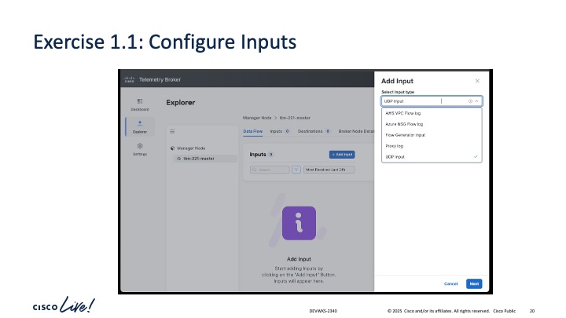

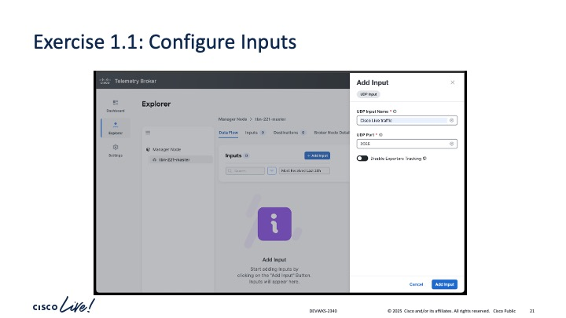

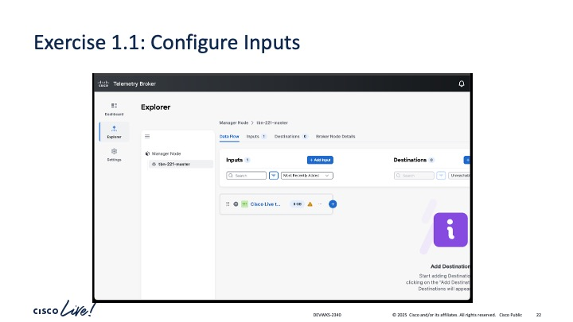

#### Configure Destination

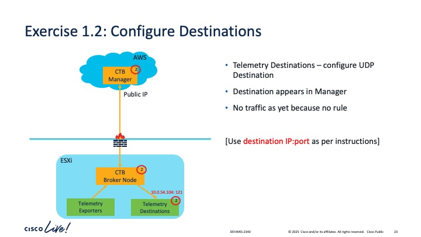

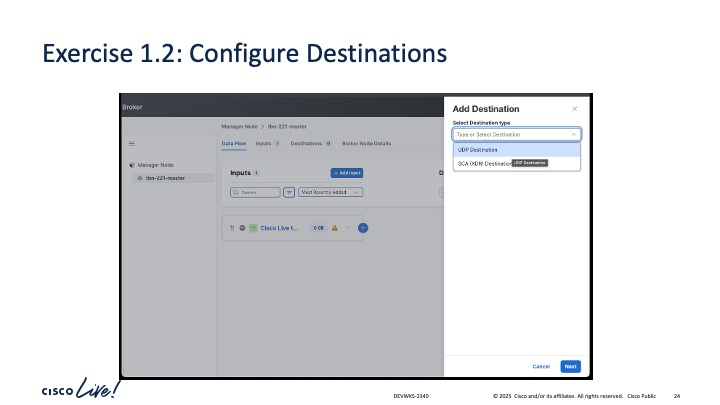

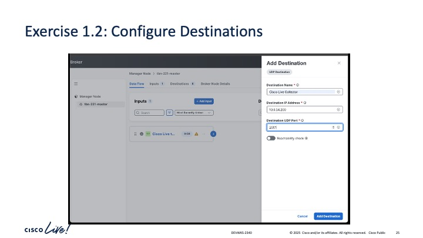

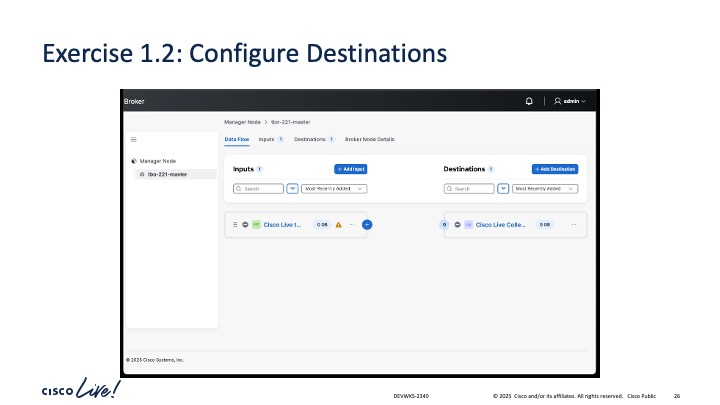

#### Configure Rules

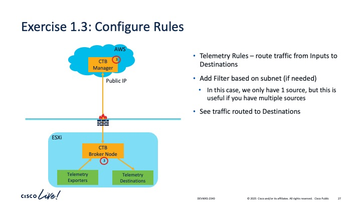

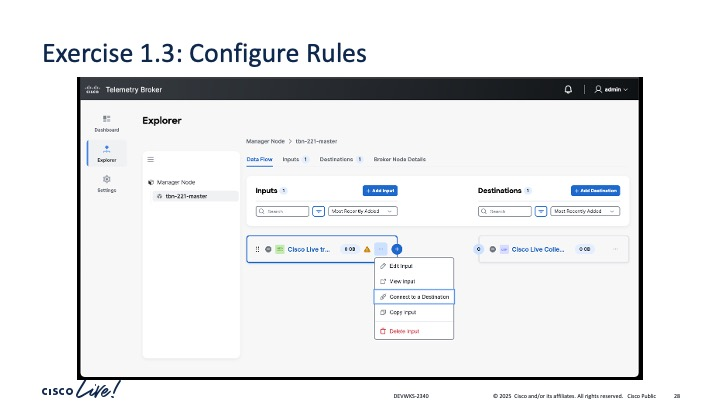

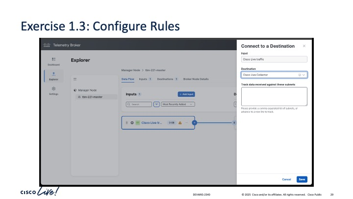

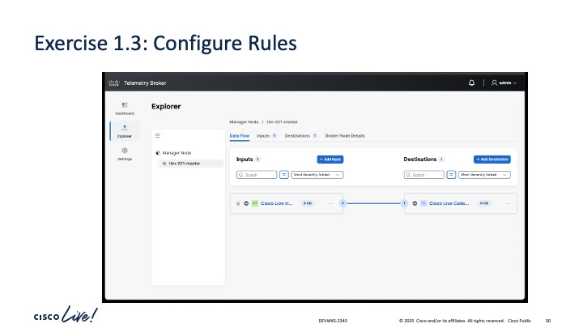

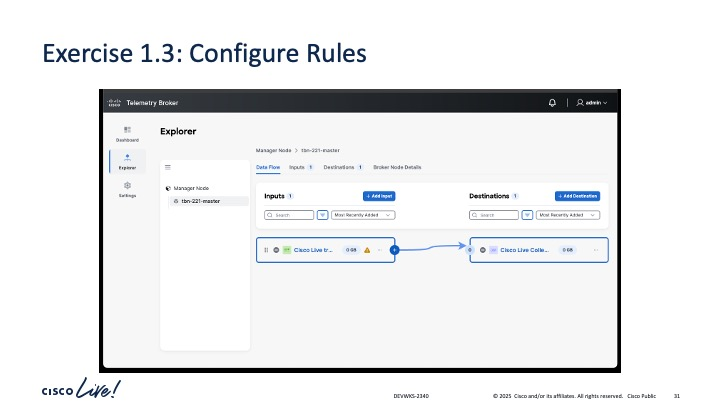

#### Visualize Data

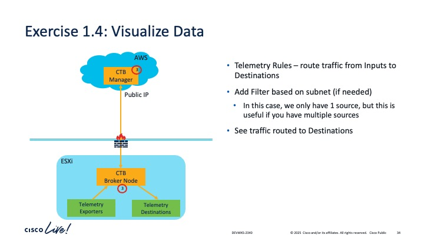

### Exercise 2 (UDP Input -> Output via API)

